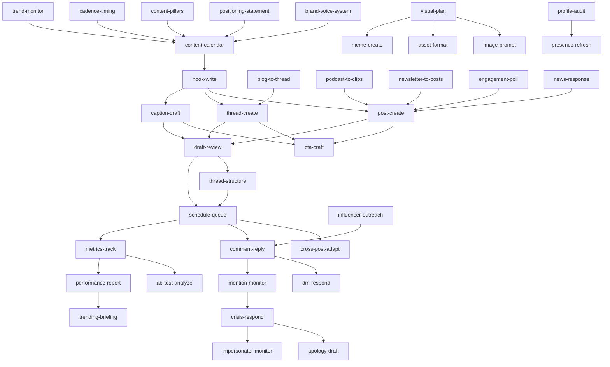

# Crewm8 Social Skill Graph

**A complete social media operator's playbook — 37 skills, 12 functions, any agent.**

> Built by [Crewm8](https://crewm8.ai) — a free, open-source skill graph for the agent ecosystem. Works with Hermes Agent, Claude Code, Factory Droid, Cursor, Windsurf, OpenAI agents, and any markdown-skill-aware agent.

---

## What This Is

37 discrete, agent-agnostic skills covering every function of startup social media management — from brand strategy and content creation through publishing, engagement, analytics, and crisis management. Each skill works independently and chains together for automated workflows.

- **37 SKILL.md files** organized into 12 categories
- **4 platforms:** X, LinkedIn, Instagram, TikTok
- **Agent-agnostic:** No agent-specific metadata. Universal YAML format.
- **Open source:** MIT license. Built by Crewm8. Free for any agent to use.

---

## About Crewm8

[Crewm8](https://crewm8.ai) builds autonomous agents for go-to-market operations. This skill graph is our gift to the agent ecosystem — a complete, production-tested set of social media management capabilities that any agent can load and use immediately.

---

## Skill Graph

This is the dependency graph showing how skills chain together in a typical weekly workflow:



---

## Installation

### Hermes Agent
```bash
hermes skills tap add gokulb20/Crewm8-Social-Media-Manager-Skill-Graph
hermes skills install gokulb20/.../skills/strategy/brand-voice-system
```

### Claude Code
```bash
git clone https://github.com/gokulb20/Crewm8-Social-Media-Manager-Skill-Graph.git ~/.crew-skills
ln -s ~/.crew-skills/skills /path/to/project/.claude/skills/
```

### Factory Droid
```bash
cp -r ~/.crew-skills/skills/* .factory/skills/       # project-level
cp -r ~/.crew-skills/skills/* ~/.factory/skills/      # personal-level
```

### Cursor / Windsurf
```bash
ln -s ~/.crew-skills/skills /path/to/project/.cursor/skills/
# Reference in .cursorrules: "You have social media skills at ~/.crew-skills/skills/"
```

### OpenAI agents / Custom GPTs
Upload individual SKILL.md files as knowledge base documents. No special configuration needed.

### Any markdown-aware agent
Point your agent at the `skills/` directory. Flat YAML frontmature (`name`, `description`, `tags`) is the universal standard.

Full per-agent install guides: `docs/install-*.md`

---

## Skill Index

### Strategy
| # | Skill | Description | Inputs Required | Delivers |
|---|-------|-------------|----------------|----------|
| 1 | brand-voice-system | Extract brand voice, build do/don't guide, detect drift | Content samples, founder voice refs | Voice guide document |
| 2 | positioning-statement | Craft elevator pitch and niche positioning | Brand materials, customer interviews | Positioning document |
| 3 | content-pillars | Define 3-5 pillars and topic taxonomy | Positioning, audience insights | Pillar document + topic bank |

### Planning
| # | Skill | Description | Inputs Required | Delivers |
|---|-------|-------------|----------------|----------|
| 4 | content-calendar | Weekly/monthly day-by-day content plan | Pillars, cadence, key dates | Content calendar |
| 5 | cadence-timing | Posting frequency and per-platform best times | Audience data, analytics | Cadence guide |

### Creation
| # | Skill | Description | Inputs Required | Delivers |
|---|-------|-------------|----------------|----------|
| 6 | post-create | Platform-native single posts for all 4 platforms | Topic, voice guide, platform | Formatted post text |
| 7 | thread-create | Multi-tweet X threads with hooks and CTAs | Source material, CTA | Thread draft + auto-plug config |
| 8 | hook-write | Generate 5-10 hook variations per post | Core idea, platform | Hook variations with scores |
| 9 | cta-craft | Select and write optimal CTA per post | Post goal, value level, platform | CTA text + rationale |

### Repurpose
| # | Skill | Description | Inputs Required | Delivers |
|---|-------|-------------|----------------|----------|
| 10 | blog-to-thread | Blog post/newsletter into X thread | Blog text, CTA | Thread draft + traffic strategy |
| 11 | podcast-to-clips | Podcast transcripts into multi-platform assets | Transcript, guest info | Clip inventory + posting schedule |
| 12 | newsletter-to-posts | Newsletter into standalone social posts | Newsletter text, subscribe link | Multi-post package |

### Visual
| # | Skill | Description | Inputs Required | Delivers |
|---|-------|-------------|----------------|----------|
| 13 | visual-plan | Carousel slide-by-slide copy, banners, quote cards | Message, brand guidelines, platform | Visual brief with specs |
| 14 | meme-create | Branded meme concepts with text overlay | Context, humor style, platform | Meme concept + risk assessment |
| 15 | image-prompt | AI image prompts for Midjourney/DALL-E/SDXL | Concept, style, ratio | Generation prompts for 1-3 tools |
| 16 | asset-format | Platform dimensions, safe zones, export settings | Platform, content type | Format spec |

### Captions
| # | Skill | Description | Inputs Required | Delivers |
|---|-------|-------------|----------------|----------|
| 17 | caption-draft | IG and LinkedIn captions with hooks and hashtags | Visual, message, platform | Platform-formatted caption |

### Publishing
| # | Skill | Description | Inputs Required | Delivers |
|---|-------|-------------|----------------|----------|
| 18 | schedule-queue | Queue posts to scheduling tools | Approved posts, times, media | Publishing queue |
| 19 | cross-post-adapt | Multi-platform adaptation (no copy-paste) | Source content, target platforms | Native adaptations per platform |
| 20 | thread-structure | Thread sequencing, auto-plug rules | Draft thread, link | Sequence spec + auto-plug config |
| 21 | draft-review | Founder review queue with sign-off checklist | Drafts, review cadence | Review queue with status |

### Engagement
| # | Skill | Description | Inputs Required | Delivers |
|---|-------|-------------|----------------|----------|
| 22 | comment-reply | Replies on own posts + value-add on others' | Comments, target accounts | Reply drafts |
| 23 | dm-respond | DM triage with categorization and response drafts | Inbound DMs | DM responses + escalation |
| 24 | mention-monitor | Track brand mentions, reply within 2-4 hours | Brand handles, keywords | Mention report |
| 25 | influencer-outreach | Micro-influencer identification + outreach drafts | Brand positioning, offer | Outreach shortlist + drafts |
| 26 | engagement-poll | Design polls and audience questions | Poll purpose, platform | Poll + follow-up plan |

### Trends
| # | Skill | Description | Inputs Required | Delivers |
|---|-------|-------------|----------------|----------|
| 27 | trend-monitor | Daily trend scan with fit matrix scoring | Niche, accounts to monitor | Trend report with recommendations |
| 28 | news-response | Quick-response posts to industry news | News item, positioning | Response draft |
| 29 | trending-briefing | Daily/weekly founder briefing | Trend + news outputs | Founder briefing |

### Analytics
| # | Skill | Description | Inputs Required | Delivers |
|---|-------|-------------|----------------|----------|
| 30 | metrics-track | Track post-level metrics with anomaly detection | Platform analytics | Metrics snapshot |
| 31 | ab-test-analyze | A/B test analysis with winner declaration | Hypothesis, results | Test analysis |
| 32 | performance-report | Weekly/monthly performance summaries | Metrics, A/B results, calendar | Performance report |

### Crisis
| # | Skill | Description | Inputs Required | Delivers |
|---|-------|-------------|----------------|----------|
| 33 | crisis-respond | Detect and respond to PR issues | Situation, escalation contacts | Response plan |
| 34 | apology-draft | Apology/correction posts with tone calibration | Situation, founder availability | Apology draft |
| 35 | impersonator-monitor | Detect fake accounts, manage takedowns | Brand handles | Detection report |

### Profile
| # | Skill | Description | Inputs Required | Delivers |
|---|-------|-------------|----------------|----------|
| 36 | profile-audit | Cross-platform consistency check | Profile URLs | Audit + remediation plan |
| 37 | presence-refresh | Bio optimization + pinned post rotation | Current state, campaign schedule | Refresh plan |

---

## Chained Workflow: Weekly Content Cycle

1. **Sunday/Monday morning:** `trend-monitor` → `content-calendar` (inject trending opportunities into the week's plan)
2. **Monday:** Run creation skills (`hook-write` → `post-create`, `thread-create`, `caption-draft`)
3. **Monday-Tuesday:** Repurpose existing content (`blog-to-thread`, `podcast-to-clips`, `newsletter-to-posts`)
4. **Tuesday:** Plan visuals if needed (`visual-plan` → `image-prompt` / `asset-format`)
5. **Tuesday-Wednesday:** `draft-review` gate (founder sign-off)
6. **Wednesday:** Structure and schedule (`thread-structure` → `schedule-queue`)
7. **Daily (ongoing):** `comment-reply` + `dm-respond` + `mention-monitor` for engagement
8. **Friday:** `metrics-track` → `performance-report` → `trending-briefing`
9. **Monthly:** `profile-audit` → `presence-refresh`

---

## Platform Coverage

Every applicable skill includes platform-specific guidance for X, LinkedIn, Instagram, and TikTok:

| Dimension | X | LinkedIn | Instagram | TikTok |
|-----------|---|----------|-----------|--------|
| Character limit | 280 | 3,000 | 2,200 | 4,000 (caption) |
| Link placement | Final tweet or reply | Anywhere after hook | Bio link only | Bio link only |
| Best format | Threads, short posts | Carousels, story posts | Visuals + captions, Stories | Video-first |
| Hashtag density | 0-1 | 3-5 | 5-10 | 3-5 |
| Image aspect ratio | 16:9 | 4:5 (carousel) | 4:5 or 1:1 | 9:16 |

---

## SKILL.md Format Reference

Every skill uses the universal agent-agnostic format:

```yaml
---
name: skill-name
description: Action-oriented one-line description (used by agents for skill matching)
version: 2.0.0
author: Crewm8
maintainer: Gokul (github.com/gokulb20)
license: MIT
homepage: https://crewm8.ai
tags: [social, category, keywords]
related_skills: [other-skill-names]
inputs_required: [what-the-agent-needs-before-starting]
deliverables: [what-the-skill-produces]
compatible_agents: [hermes, claude-code, droid, cursor, windsurf, openai, generic]
requires_capabilities: [text-generation]  # optional
---
```

Body sections: **Purpose → When to Use → Inputs Required → Quick Reference → Procedure → Output Format → Platform Notes → Done Criteria → Pitfalls → Verification → Example**

---

## License & Credits

- **License:** MIT — free to use, modify, and distribute
- **Built by:** [Crewm8](https://crewm8.ai)
- **Repository:** [github.com/gokulb20/Crewm8-Social-Media-Manager-Skill-Graph](https://github.com/gokulb20/Crewm8-Social-Media-Manager-Skill-Graph)

---

## Stats

| | |
|---|---|
| Skills | 37 |
| Categories | 12 |
| Platforms | 4 (X, LinkedIn, IG, TikTok) |
| Compatible agents | All major markdown-skill-aware agents |
| Lines of instruction | ~11,000 |
| License | MIT |
