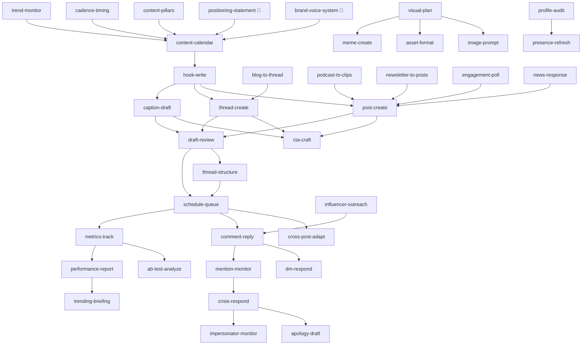

# Skill Graph

Below is the dependency graph showing how skills chain together in a typical weekly workflow. Each arrow means "output from this skill feeds into" the target skill.

## Full Dependency Map

## Legend

- **🏁** = Foundation skills. Run these first when onboarding a new brand.
- **→** = "feeds into" or "its output is used by"
- **Diamond** = Multiple skills converge on a single downstream skill (e.g., 7 creation skills feed into `draft-review`)

## Typical Weekly Sequence

1. **Sunday/Monday morning:** `trend-monitor` → `content-calendar` (injects trending opportunities into the week's plan)
2. **Monday:** Run creation skills against calendar slots (`hook-write` → `post-create`, `thread-create`, `caption-draft`)
3. **Monday-Tuesday:** Run repurpose skills if there's existing content to mine (`blog-to-thread`, `podcast-to-clips`, `newsletter-to-posts`)
4. **Tuesday:** Plan visuals if needed (`visual-plan` → `image-prompt` / `asset-format`)
5. **Tuesday-Wednesday:** `draft-review` gate (founder signs off)
6. **Wednesday:** Structure threads and schedule queue (`thread-structure` → `schedule-queue`)
7. **Daily (ongoing):** `comment-reply` + `dm-respond` + `mention-monitor` for engagement
8. **Friday:** `metrics-track` (pull weekly data) → `performance-report` → `trending-briefing`
9. **Monthly:** `profile-audit` → `presence-refresh`

## Independent Skills

These skills can run on their own without depending on the calendar pipeline:
- `meme-create` (run when trending format detected or engagement needs a boost)
- `engagement-poll` (run when audience research needed)
- `cross-post-adapt` (run when content needs platform-specific versions)
- `influencer-outreach` (run quarterly, independent of daily workflow)
- `ab-test-analyze` (run after enough A/B test data accumulates)
- `crisis-respond` / `apology-draft` / `impersonator-monitor` (event-driven, not scheduled)
